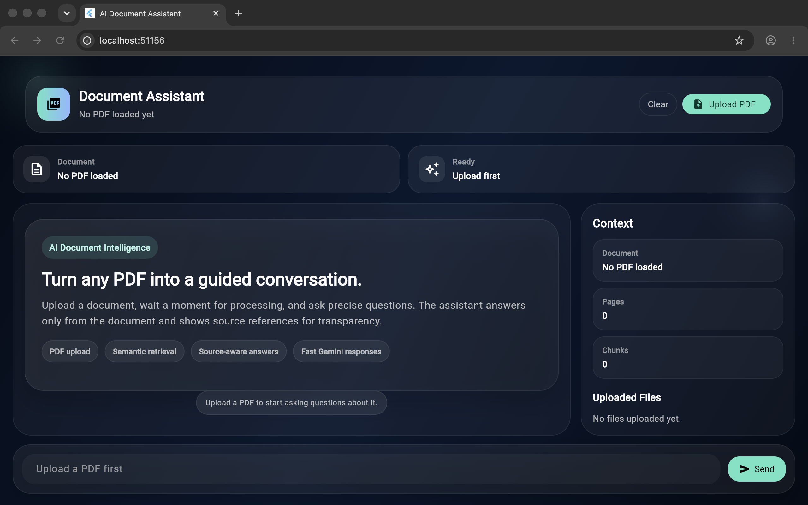
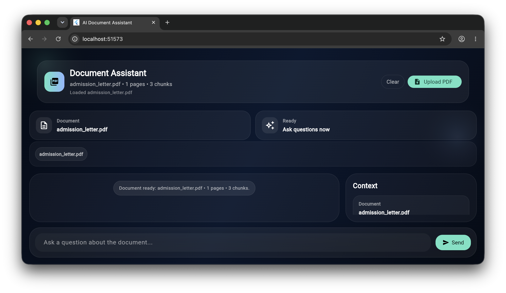
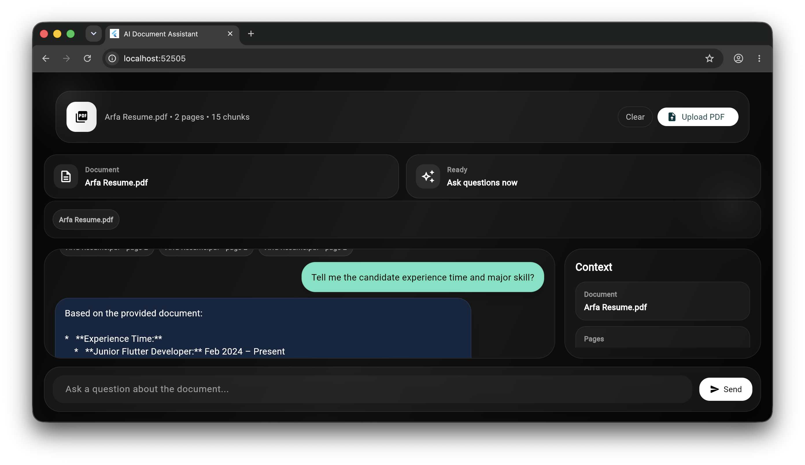
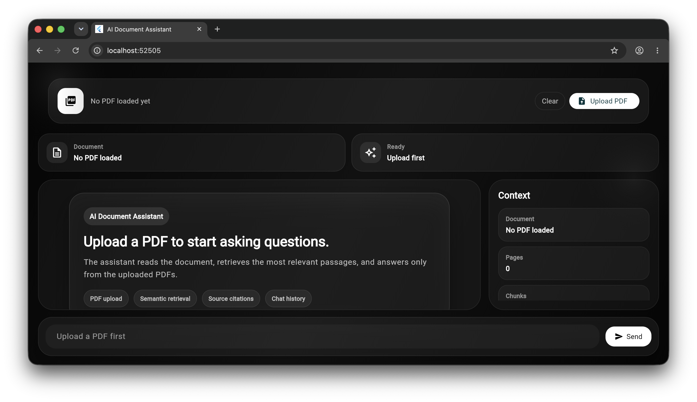

# AI Document Assistant

AI Document Assistant is a full-stack PDF question-answering application built with a **FastAPI backend, Gemini, and Flutter Web**.

It supports **multi-PDF conversational RAG**, source citations, semantic search, and answers grounded only in the uploaded documents.

## Screenshot Preview

| Upload state | Uploaded document |
| --- | --- |
|  |  |

| Conversation with citations | Clear/new document state |
| --- | --- |
|  |  |

## Features

- Upload multiple PDFs in a single session
- Ask questions about uploaded documents
- Conversational follow-up questions
- Semantic search using Gemini embeddings
- Top-K retrieval with similarity threshold filtering
- PDF text extraction and intelligent chunking
- Answers grounded only in retrieved document context
- Source citations with filename and page metadata
- Conversation memory for follow-up questions
- FastAPI backend
- Flutter Web chat interface
- Backend-only Gemini API key
- Clear documents and conversation memory

## How It Works

The application uses a Retrieval-Augmented Generation (RAG) pipeline.

```text
Flutter Web
    ↓
FastAPI Backend
    ↓
PDF Processing
    ↓
Text Extraction
    ↓
Chunking
    ↓
Gemini Embeddings
    ↓
Semantic Similarity Search
    ↓
Relevant Chunks
    ↓
Gemini RAG Answer
    ↓
Answer + Source Citations
